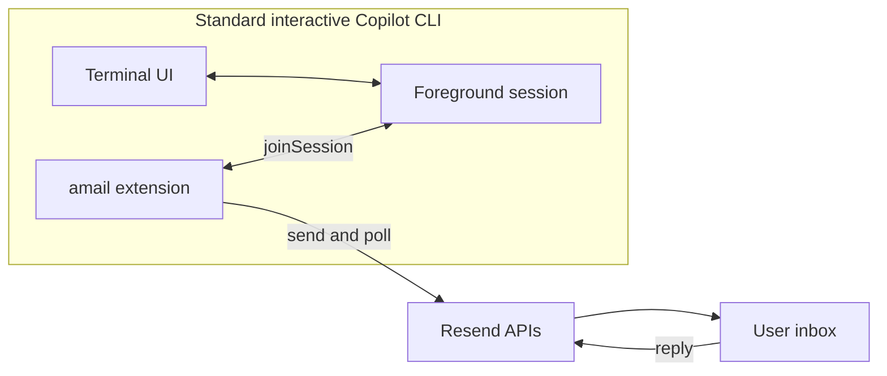

# amail: email as a Copilot control surface

Status: implementation plan
Created: 2026-09-02
Updated: 2026-09-03

## Goal

`amail` lets someone step away from a standard interactive GitHub Copilot CLI session without losing the ability to:

1. answer a question Copilot is waiting on;
2. receive the result when the current turn finishes;
3. reply with one follow-up instruction for the same session.

The first version targets one local user, one interactive Copilot session, and one configured email address.

## Take-home boundary

The implementation must fit in 3-5 hours. The committed MVP contains exactly three flows:

- **Question:** mirror a native Copilot question to email and return the answer to that exact request.
- **Complete:** email the final response when the root turn becomes idle.
- **Continue:** inject a reply to that completion email as the next prompt in the same session.

Everything else is outside the committed MVP:

- permission approval by email;
- multiple simultaneous Copilot sessions;
- durable recovery after Copilot or the extension exits;
- error-specific notifications;
- webhook deployment;
- a separate daemon, named pipe, or database;
- attachments, rich HTML, or a web UI;
- generalized email commands and production security hardening.

This is a version-pinned prototype for Copilot CLI `1.0.83-3`, not a production integration.

## First milestone: native-event go/no-go

The highest-risk assumption is whether a joined extension can observe the session's active native question event (`user_input.requested` or `elicitation.requested`) while the standard TUI remains an active responder.

Before implementing Resend or persistence:

1. Load a minimal project extension and call `joinSession()`.
2. Subscribe to both native question event variants.
3. Trigger a harmless native Copilot question.
4. If necessary, register interest for the active event through `session.rpc.eventLog.registerInterest()`.
5. Verify that the extension receives the request **and** the terminal can still answer it.
6. Resolve a second request through the corresponding native UI RPC and verify `success: true`.
7. Answer a third request in the terminal first and verify the extension receives `success: false`.

### Decision

- **Probe succeeds:** native question mirroring is the MVP question flow.
- **Probe fails or suppresses the TUI:** do not replace the native handler. Use the extension's explicit `ask_human_by_email` tool as the question flow.

This decision is made in the first 30 minutes. No later work depends on an unverified native-event assumption.

### Milestone result

The probe passed on Copilot CLI `1.0.83-3` for the active `elicitation.requested` variant:

- registering event interest delivered the request to the extension;
- the normal structured terminal form remained usable;
- `session.rpc.ui.handlePendingElicitation()` resolved an outstanding request with `success: true`;
- after the terminal answered first, the same RPC returned `success: false`.

The extension also contains the equivalent legacy `user_input.requested` listener, but that variant was not active in this session and therefore remains unverified live.

### Implementation validation

- The native Copilot request observation and first-writer-wins RPC behavior were exercised live.
- The configured Resend key successfully listed received email through the live API.
- The three MVP routing flows are covered with the real Copilot event/RPC shapes and fixture-backed Resend responses.
- Live outbound delivery to the requested Microsoft recipient is pending a Resend-verified sending domain; a receiving domain alone cannot be used as `AMAIL_FROM`.

## User experience

The user starts Copilot normally:

```text
copilot
```

The project extension joins the foreground session. Away mode is represented by a small marker file under `%LOCALAPPDATA%\amail\`; a minimal `amail away on|off` command creates or removes it.

### Question

When away mode is on and Copilot emits a native user-input request:

```text
Subject: amail: input needed

Copilot needs your input:

Which pagination style should I implement?

1. Previous/next links
2. Page numbers
3. Infinite scroll

Reply with one option or its number.
```

The extension keeps the terminal prompt active. The first terminal or email answer wins through Copilot's request-ID API.

If native mirroring failed its initial probe, the agent instead calls:

```ts
ask_human_by_email({
  question: string,
  choices?: string[]
}): {
  status: "answered" | "timeout",
  answer?: string
}
```

### Complete

When the root session becomes idle without being aborted, the extension sends the last root assistant response:

```text
Subject: amail: Qworg/amail complete

Repository: Qworg/amail

Implemented previous/next pagination and added coverage.

Reply with one follow-up instruction while this session remains idle.
```

The extension sends only while away mode is on. It ignores sub-agent idle events and does not send a completion message for aborted turns.

### Continue

The completion email contains a new single-use reply token. When a valid reply arrives:

1. confirm the Copilot session is still the same;
2. confirm no terminal prompt has started since the completion email;
3. call `session.send({ prompt, mode: "enqueue", displayPrompt })`;
4. consume the token so the instruction cannot be replayed.

If the session moved on or exited, reject the reply with a short email rather than applying it to stale context.

## Architecture



The extension is the whole running application. It:

- joins the foreground session;
- observes native question, completion, and session-progress events;
- exposes the fallback agent tool;
- sends email and polls received messages;
- holds pending requests and single-use tokens in memory;
- injects accepted follow-ups with `session.send()`.

There is no daemon, IPC protocol, database, or reconnect state machine in the MVP.

## Configuration

The extension requests `RESEND_API_KEY` through the Copilot extension environment-variable approval flow.

For the exercise, the user loads only `RESEND_API_KEY` from `../.env` into the environment before starting Copilot. The extension also needs:

```text
AMAIL_TO=<authorized email address>
AMAIL_FROM=<verified Resend sender>
AMAIL_RECEIVE_DOMAIN=<Resend receiving domain>
```

The away marker and any captured test fixture live under `%LOCALAPPDATA%\amail\`, not in the repository.

## Email routing and safety

The MVP uses a deliberately small trust model:

- Each outbound message gets a random, single-use 128-bit reply token.
- Tokens are scoped to either one pending question or one follow-up prompt.
- Only mail from the configured address is accepted.
- Duplicate Resend message IDs and reused tokens are ignored.
- Native answers are applied only through their original Copilot request ID.
- A stale native answer is never converted into a new prompt.
- Completion replies are accepted only while the recorded session is still idle.
- Reply bodies are plain text, capped at 4 KB, with quoted history removed.
- Auto-replies and attachments are ignored.
- Outgoing summaries are capped and receive basic credential-pattern redaction.
- Raw tokens and reply-to addresses are never written to the Copilot timeline.
- Email content and routing tokens transit Resend; a compromised authorized mailbox is outside the MVP threat model.

The extension does not approve tools or shell commands by email. Copilot's normal permission UI and policy remain authoritative.

## In-memory state

```ts
type PendingQuestion = {
  tokenHash: string;
  requestId: string;
  choices?: string[];
  allowFreeform: boolean;
  expiresAt: number;
};

type PendingFollowup = {
  tokenHash: string;
  sessionId: string;
  idleMarker: string;
  expiresAt: number;
};
```

Native questions expire when:

- `user_input.completed` fires;
- the root turn aborts;
- the extension reloads or exits;
- the token reaches its timeout.

Losing this state is acceptable: the standard terminal remains available, and stale email replies fail closed.

## Timebox

| Time | Work |
|---|---|
| 0:00-0:30 | Native-event probe and go/no-go decision |
| 0:30-1:15 | Resend send/receive proof and captured inbound fixture |
| 1:15-2:15 | Token routing, reply parsing, and fixture-driven tests |
| 2:15-3:15 | Question flow: native mirroring or explicit tool fallback |
| 3:15-4:15 | Idle completion email and same-session follow-up |
| 4:15-5:00 | README, failure messages, cleanup, and recorded demo |

If the completion/reply path is not working by 4:15, stop adding features and finish the demonstrable path.

## Acceptance criteria

1. Copilot remains a normal interactive TUI throughout the demo.
2. One question can be answered by email without applying the answer to the wrong request.
3. The terminal can still answer first, making the later email reply harmless.
4. A non-aborted root idle sends one concise completion email.
5. One valid reply creates one visibly labeled follow-up turn in the same idle session.
6. Wrong sender, reused token, duplicate message, and stale-session reply do not inject a prompt.
7. A captured inbound fixture can demonstrate routing when live mail is delayed.

The minimum shippable submission is criteria 1-6. The fixture is the demo fallback, not a separate product feature.

## Follow-ups deliberately deferred

- native permission mirroring and approval;
- supporting native question variants beyond the one active in the pinned CLI session;
- batching multiple questions;
- durable queues and restart recovery;
- multiple connected sessions;
- richer sender-authentication checks;
- notification budgets, STOP commands, and operational controls;
- a standalone daemon or hosted webhook receiver.

These are reasonable next steps only after the three MVP flows prove useful.

## Primary references

- Copilot CLI extensions overview: https://docs.github.com/en/copilot/concepts/agents/copilot-cli/about-cli-extensions
- Installed SDK extension guide: `C:\Users\jeffkramer\.copilot\pkg\win32-x64\1.0.83-3\copilot-sdk\docs\extensions.md`
- Installed SDK examples: `C:\Users\jeffkramer\.copilot\pkg\win32-x64\1.0.83-3\copilot-sdk\docs\examples.md`
- Resend receiving introduction: https://resend.com/docs/dashboard/receiving/introduction
- Resend list received emails API: https://resend.com/docs/api-reference/emails/list-received-emails
- Resend retrieve received email API: https://resend.com/docs/api-reference/emails/retrieve-received-email
